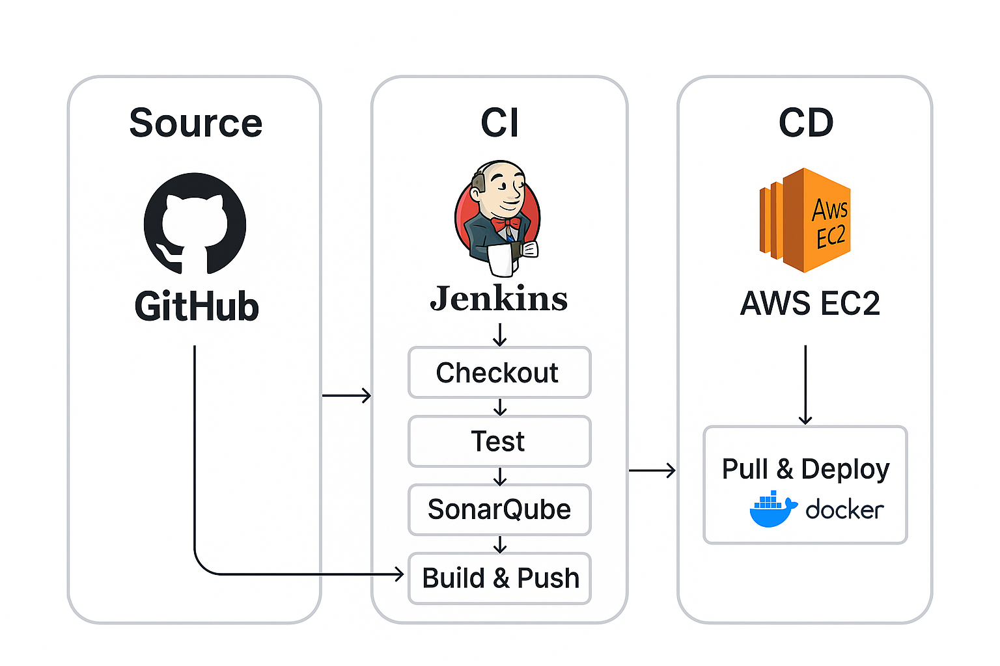

# To-Do API CI/CD Demo

[](https://hub.docker.com/r/spethan1/todo-api)  


---

## 🚀 Overview

A simple **Node.js + Express** To-Do REST API showcasing a professional end-to-end CI/CD pipeline with:

- **Automated testing** (Jest + Supertest)  
- **Code quality** gating (SonarQube)  
- **Containerization** (Docker multi-stage build)  
- **Local orchestration** (Docker Compose)  
- **CI/CD orchestration** (Jenkins with a `Jenkinsfile`)  
- **Staged deployment** to an **AWS EC2** host  

---

## ✨ Features

- **Full CRUD** for To-Do items  
- **Interactive** landing page UI  
- **Unit & integration tests** with 100% pass rate  
- **Quality gates** on code smells & security vulnerabilities  
- **Immutable Docker images** tagged by build number & `latest`  
- **Automatic deploy** to staging on each successful build  

---

## 📐 Architecture



1. **GitHub** holds the source code and `Jenkinsfile`.  
2. **Jenkins**  
   - **Checks out** code  
   - **Analyzes** with SonarQube  
   - **Runs tests** (`npm ci && npm test`)  
   - **Builds** Docker image  
   - **Pushes** image to Docker Hub  
   - **Deploys** to staging via SSH + Docker Compose  
3. **Docker Hub** stores versioned images.  
4. **AWS EC2 (staging)** pulls & runs the image with `docker-compose.staging.yml`.  

---

## 🛠️ Prerequisites

- **Node.js** v18+ & **npm**  
- **Docker** & **Docker Compose**  
- **Jenkins** (with plugins: Git, Docker Pipeline, SonarQube Scanner)  
- **SonarQube** server (LTS)  
- **AWS** account with an Ubuntu 22.04 EC2 instance  

---

## ⚙️ Getting Started

### Clone the Repo

```bash
git clone https://github.com/Savanpethani/TODO-Jenkins-Docker.git
cd TODO-Jenkins-Docker
```

### Local Development

```bash
npm install
npm run dev
```
Browse to http://localhost:3000 for the interactive UI.

### Running with Docker Compose
```bash
docker-compose up --build
```

## 🔧 CI/CD Pipeline

All pipeline logic lives in Jenkinsfile. It defines these stages:

1. Checkout from GitHub
2. SonarQube Analysis (quality gate)
3. Install & Test (npm ci → npm test)
4. Build Docker Image (multi-stage)
5. Push Docker Image to Docker Hub
6. Deploy to Staging via SSH + docker-compose.staging.yml

## ☁️ Deploy to Staging
The EC2 host runs:
```bash
git clone https://github.com/Savanpethani/TODO-Jenkins-Docker.git ~/todo-api
cd ~/todo-api
docker-compose -f docker-compose.staging.yml pull
docker-compose -f docker-compose.staging.yml up -d
```
## 🧰 Tech Stack
- Runtime: Node.js, Express

- Testing: Jest, Supertest

- Containerization: Docker, Docker Compose

- CI/CD: Jenkins, Jenkinsfile, GitHub

- Quality: SonarQube

- Cloud: AWS EC2

## 🤝 Contributing
1. Fork this repo
2. Create a feature branch (git checkout -b feature/NAME)
3. Commit your changes (git commit -m "feat: ..."); run tests
4. Push to branch and open a PR

